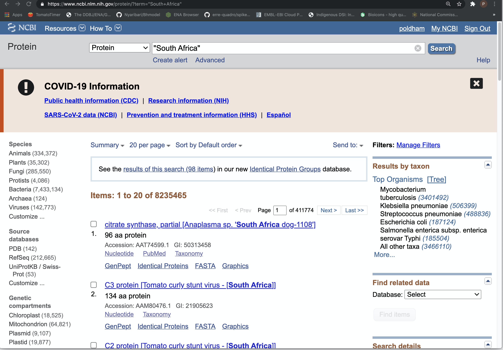
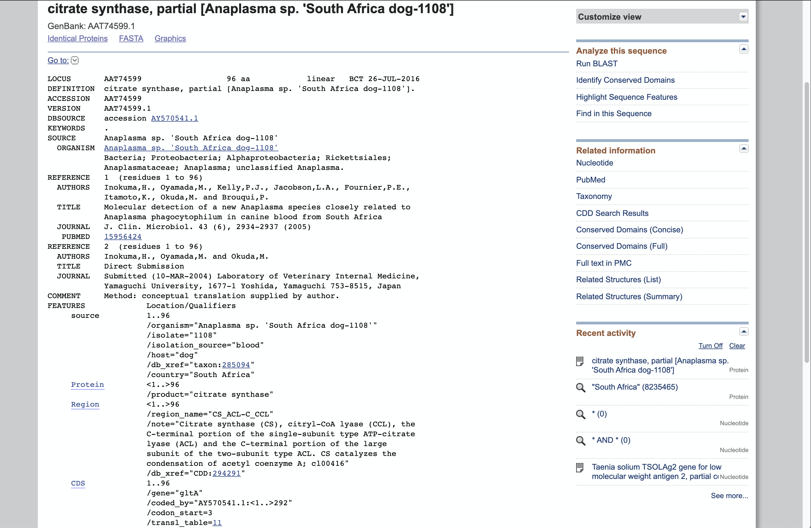

<!-- README.md is generated from README.Rmd. Please edit that file -->

# dsir

<!-- badges: start -->
<!-- badges: end -->

### Status: Experimental testing only

The `dsir` package provides an easy way for researchers and governments
to obtain country data on digital sequence information (genetic sequence
data) submitted to [NCBI
databases](https://www.ncbi.nlm.nih.gov/guide/all/) such as
[GenBank](https://www.ncbi.nlm.nih.gov/genbank/).

Digital Sequence Information (DSI) is a placeholder term for genetic
sequence data in international policy debates. The governance of DSI has
become a major focus of debate under the [United Nations Convention on
Biological Diversity and its Nagoya
Protocol](https://www.cbd.int/dsi-gr/) as well as the [Plant
Treaty](http://www.fao.org/cgrfa/topics/digital-sequence-information/en/),
the ongoing negotiations of the [new treaty on marine
biodiversity](https://www.un.org/bbnj/) (Biodiversity Beyond National
Jurisdiction or BBNJ) under UNCLOS and the sharing of virus materials
under the [PIP Framework](https://www.who.int/influenza/pip/en/) at the
World Health Organisation (WHO). The pandemic has sharpened attention to
the governance of sequence data.

One challenge for governments in these debates, notably from developing
countries, is identifying up to date data on sequence submissions that
originate in samples from their country to inform evidence based
discussion. This is the challenge that `dsir` aims to help solve.

Existing tools for sequence data focus on submitting and accessing
sequence listings. In contrast, for policy discussions what is mainly of
interest is the `metadata` about the sequences. What is needed is a
slimmed down approach that focuses on metadata… while allowing sequence
data to be accessed as needed.

This package provides the following:

-   A small set of R functions to obtain up to date NCBI esummary
    (metadata) on sequences from countries
-   A set of country datasets to allow researchers to explore the data
    in detail.

`dsir` provides simplified wrappers for some of the functions from the
[ROpenSci](https://ropensci.org/)
[rentrez](https://docs.ropensci.org/rentrez/) package created by David
Winter and collaborators. `rentrez` provides access to the NCBI [E-Utils
API](https://www.ncbi.nlm.nih.gov/books/NBK25500/) for remotely
accessing NCBI databases. The credit for the underlying code that powers
`dsir` therefore belongs with David Winter and collaborators. You can
visit `rentrez`
[here](%5Bhttps://github.com/ropensci/rentrez%5D(https://github.com/ropensci/rentrez))
and give it some love by leaving a star.

`dsir` is designed to be easy to use for people who are new to R and to
facilitate the automated retrieval and monitoring of sequence data
originating from a country. However, the underlying `rentrez` package
provides a powerful set of tools for the exploration and retrieval of
sequence related data from the network of NCBI databases. More advanced
R users will want to engage with the rich function set provided by the
`rentrez` package.

## Installation

If you have arrived here and you are completely new to the R programming
language, do not fear. You need to start by installing R and RStudio on
your computer following the instructions in Garrett Grolemund’s
excellent and free [Hands On Programming with
R](https://rstudio-education.github.io/hopr/). Follow Garret’s
instructions
[here](https://rstudio-education.github.io/hopr/starting.html) and when
you have time read the rest of the book.

`dsir` is not on CRAN and can be installed from
[GitHub](https://github.com/) with:

``` r
# install.packages("devtools")
devtools::install_github("poldham/dsir")
```

## Getting Started

The NCBI API provides higher level access to data if you register with
the system and obtain an API token (a unique key). You can use the
functions without an API key but access is limited to three calls per
second.

To register for an account with NCBI go
[here](https://www.ncbi.nlm.nih.gov/account/register/?back_url=https%3A%2F%2Fwww.ncbi.nlm.nih.gov%2Fhome%2Fdevelop%2Fapi%2F&partners-uri=cms:/account/partners).
Note that from June 2021 NCBI will move to third party logins
(e.g. using Google, and institutional or government login), see
[here](https://ncbiinsights.ncbi.nlm.nih.gov/2021/01/05/important-changes-ncbi-accounts-2021/)
for more details. Depending on when you land on this page, follow the
latest instructions.

Inside your account profile you will be able to create an API. Go to
your name in the top right corner to access your account details. There
you will see a panel called `API Key Management`. Generate an API key
and copy it.

One way to store the key is in your R environment with the `usethis`
package (for a greater degree of security use the credentials package).
As `dsir` is built on `rentrez` we should also install it at the same
time.

``` r
install.packages("usethis")
install.packages("rentrez")
```

``` r
usethis::edit_r_environ()
```

In the R environment file enter the following, save the file and then
`Session > Restart R` so that the change takes effect.

``` r
ENTREZ_KEY="my Entrez key"
```

When you have restarted R you will be good to go. The approach above is
that used by `rentrez` and so you can now happily also use the `rentrez`
package without further setup.

### Understanding the databases

NCBI contains a large number of databases. These databases are linked
together through a spiders web of connections.

To understand the databases that are accessible we can use `rentrez`.

``` r
library(rentrez)
entrez_dbs()
```

    ##  [1] "pubmed"          "protein"         "nuccore"         "ipg"            
    ##  [5] "nucleotide"      "structure"       "genome"          "annotinfo"      
    ##  [9] "assembly"        "bioproject"      "biosample"       "blastdbinfo"    
    ## [13] "books"           "cdd"             "clinvar"         "gap"            
    ## [17] "gapplus"         "grasp"           "dbvar"           "gene"           
    ## [21] "gds"             "geoprofiles"     "homologene"      "medgen"         
    ## [25] "mesh"            "ncbisearch"      "nlmcatalog"      "omim"           
    ## [29] "orgtrack"        "pmc"             "popset"          "proteinclusters"
    ## [33] "pcassay"         "protfam"         "biosystems"      "pccompound"     
    ## [37] "pcsubstance"     "seqannot"        "snp"             "sra"            
    ## [41] "taxonomy"        "biocollections"  "gtr"

For those interested in GenBank (the best known of these databases) note
that there is no entry for genbank. What we want here is the `nuccore`
(for nucleotice core, also known as nucleotide) database. But, before
rushing on, notice all of the other databases such as pubmed for
publications, bioproject and biosample. If you work with a public
collection you will probably want to take a look at biocollections.

These databases are all linked in various ways and degrees. To see the
linkages we use another `rentrez` function.

``` r
library(rentrez)
rentrez::entrez_db_links("nuccore")
```

    ## Databases with linked records for database 'nuccore'
    ##  [1] assembly        assembly        biocollections  bioproject     
    ##  [5] bioproject      bioproject      biosample       biosystems     
    ##  [9] ccds            clone           nuccore         dbvar          
    ## [13] gene            genome          genome          geoprofiles    
    ## [17] homologene      nuccore         nuccore         nuccore        
    ## [21] nuccore         nuccore         nuccore         nuccore        
    ## [25] nuccore         nuccore         nuccore         omim           
    ## [29] pccompound      pcsubstance     pmc             popset         
    ## [33] probe           protein         protein         protein        
    ## [37] protein         protein         protein         protein        
    ## [41] protein         proteinclusters pubmed          pubmed         
    ## [45] pubmed          snp             sparcle         sra            
    ## [49] sra             structure       taxonomy        trace

We won’t go into the detail of these linkages here except to highlight
that once you have the data from one database you can then retrieve data
from other linked databases.

### Counting Sequence Records from A Country

Country names appear in NCBI data in two main forms:

1.  In the country field (country tag)
2.  In an organism description (e.g. for a strain or variety) or other
    part of a record

We want to capture both of these bearing in mind that in a later step we
will want to examine and filter out any noisy records.

To search and obtain country data we follow a four step process:

1.  Obtain a count of the records
2.  Fetch the records
3.  Parse the records to a table (data.frame)
4.  Save the data

We want to start by obtaining a count because even though we are working
with summary records the data gets big… fast. For example, the summary
records for 2.4 million summary records for South Africa take up 45Gb.
So, let’s not blow up the laptop by accident.

We use `dsi_count()` to generate counts. Note that the default database
for all functions is ‘nuccore’.

``` r
library(dsir)
south_africa <- dsi_count(country = "South Africa", db = "nuccore")
```

    ## ℹ there are 2470233 records in the 'nuccore' database for 'South Africa'

While we will mainly focus on the nucleotide database note that we can
search all the other databases in the list. What we need to be careful
about is that the reason a country appears in a record may be a
reference to a submitting organisation rather than the origin of the
material. So, view these counts as raw for exploration.

``` r
library(dsir)
south_africa_proteins <- dsi_count(country = "South Africa", db = "protein")
```

    ## ℹ there are 8329247 records in the 'protein' database for 'South Africa'

When conducting counts it is a good idea to have the NCBI database
search open so that you can check and investigate a query. If you are
running the query above it will appear at this url
<https://www.ncbi.nlm.nih.gov/protein/?term=%22South+Africa%22>



Notice in the top records we can see that our search term appears in the
titles. If we open one of these records we can inspect the presence of
the country name.

 In this
case under FEATURES we can see that the country is referenced as South
Africa (the source of the sample for the protein).

As this suggests, we may want to start by capturing everything that
mentions a country and then narrow the focus down to the sample name. To
do that we can use the country qualifier.

NCBI databases allow for the use of a set of fields to limit searches in
various ways. You can find the table of fields
[here](https://www.ncbi.nlm.nih.gov/books/NBK49540/table/Sequences_help_appe.T.fields_available_f/?report=objectonly).
The country name appears in the list of features and we might imagine
that we could use a feature key in the same way as for organism or
isolate, except that we can’t. The country field is linked to a table of
country names that you will find [here](http://www.insdc.org/country).

To use the country qualifier we can start with an open wildcard search
as in the manual [here](http://www.insdc.org/country).

``` r
dsi_count(country = "/country=*", db = "nuccore")
```

    ## ℹ there are 86029440 records in the 'nuccore' database for '/country=*'

This tells us or perhaps better… suggests… that there are 85 million
accessions (not sequences) that have an entry in the country field. We
can then construct a count that is restricted to the country qualifier
field.

``` r
southafrica_qual <- dsi_count(country = "country=South Africa", db = "nuccore")
```

    ## ℹ there are 2139844 records in the 'nuccore' database for 'country=South Africa'

As we would expect, this count is lower than for the general search for
South Africa across the database.

We can elaborate on this for other types of count. In international
debates on genetic sequence data human genetic material is excluded.
Let’s see how many of the South Africa records are for humans and how
many are non-human.

``` r
library(dsir)
southafrica_homo <- dsi_count(country = "(South Africa AND Homo sapiens[ORGN])", db = "nuccore")
```

    ## ℹ there are 20429 records in the 'nuccore' database for '(South Africa AND Homo sapiens[ORGN])'

``` r
southafrica_not <- dsi_count(country = "(South Africa NOT Homo sapiens[ORGN])", db = "nuccore")
```

    ## ℹ there are 2449804 records in the 'nuccore' database for '(South Africa NOT Homo sapiens[ORGN])'

If we wanted to restrict our search to the country qualifier we would
use:

``` r
library(dsir)
southafrica_homo <- dsi_count(country = "(country=South Africa AND Homo sapiens[ORGN])", db = "nuccore")
```

    ## ℹ there are 19140 records in the 'nuccore' database for '(country=South Africa AND Homo sapiens[ORGN])'

``` r
southafrica_not <- dsi_count(country = "(country=South Africa NOT Homo sapiens[ORGN])", db = "nuccore")
```

    ## ℹ there are 2120704 records in the 'nuccore' database for '(country=South Africa NOT Homo sapiens[ORGN])'

We can also use wider filters described here to build up a picture of
the holdings using the major categories of organisms used by NCBI as
filters. We will also test out restricting the records for South Africa
to those that are not Homo sapiens or humans. Here we want to check that
use of a common name produces the same score as a taxonomic name.

``` r
dsi_count(country = "country = South Africa AND animals[Filter] ", db = "nuccore")
```

    ## ℹ there are 1136740 records in the 'nuccore' database for 'country = South Africa AND animals[Filter] '

``` r
dsi_count(country = "country = South Africa AND animals[Filter] NOT Homo sapiens[ORGN])", db = "nuccore")
```

    ## ℹ there are 1117596 records in the 'nuccore' database for 'country = South Africa AND animals[Filter] NOT Homo sapiens[ORGN])'

``` r
dsi_count(country = "country = South Africa AND animals[Filter] NOT humans[ORGN])", db = "nuccore")
```

    ## ℹ there are 1117596 records in the 'nuccore' database for 'country = South Africa AND animals[Filter] NOT humans[ORGN])'

``` r
dsi_count(country = "country = South Africa AND plants[Filter] ", db = "nuccore")
```

    ## ℹ there are 34042 records in the 'nuccore' database for 'country = South Africa AND plants[Filter] '

``` r
dsi_count(country = "country = South Africa AND fungi[Filter] ", db = "nuccore")
```

    ## ℹ there are 111056 records in the 'nuccore' database for 'country = South Africa AND fungi[Filter] '

``` r
dsi_count(country = "country = South Africa AND protists[Filter] ", db = "nuccore")
```

    ## ℹ there are 42645 records in the 'nuccore' database for 'country = South Africa AND protists[Filter] '

``` r
dsi_count(country = "country = South Africa AND bacteria[Filter] ", db = "nuccore")
```

    ## ℹ there are 814853 records in the 'nuccore' database for 'country = South Africa AND bacteria[Filter] '

``` r
dsi_count(country = "country = South Africa AND archaea[Filter] ", db = "nuccore")
```

    ## ℹ there are 1248 records in the 'nuccore' database for 'country = South Africa AND archaea[Filter] '

``` r
dsi_count(country = "country = South Africa AND viruses[Filter] ", db = "nuccore")
```

    ## ℹ there are 75189 records in the 'nuccore' database for 'country = South Africa AND viruses[Filter] '

We have now generated a range of country related searches and restricted
them in various ways. If we are interested in monitoring activity over
time we do not want to be repeatedly downloading the same records if we
can avoid it. We would therefore want to restrict the records by date.
For example we might download the 2 million plus records for South
Africa and then want to get the latest month of data. An important
caveat on monitoring sequence related activity is that we would
periodically want to refresh the entire dataset to capture any changes
that have been introduced since the original search.

We can do this by specifying a range of dates in this case for the first
few months until 2021. We will do this as a general open search for
South Africa and then restrict the data to the country qualifier. Note
that the date format is YYYY/MM/DD and the separator between dates is
the `:`.

``` r
south_africa_range <- dsi_count(country = "(South Africa) AND 2021/01/01:2021/05/19[PDAT] NOT Homo sapiens[ORGN])", db = "nuccore")
```

    ## ℹ there are 37165 records in the 'nuccore' database for '(South Africa) AND 2021/01/01:2021/05/19[PDAT] NOT Homo sapiens[ORGN])'

``` r
south_africa_range2 <- dsi_count(country = "(country=South Africa) AND 2021/01/01:2021/05/19[PDAT] NOT Homo sapiens[ORGN])", db = "nuccore")
```

    ## ℹ there are 34466 records in the 'nuccore' database for '(country=South Africa) AND 2021/01/01:2021/05/19[PDAT] NOT Homo sapiens[ORGN])'

We can of course think about automating these counts when we are happy
that we have captured what needs to be captured.

### Retrieving results

To retrieve the raw results we use the `dsi_country()` function. In
contrast with `dsi_count()` the `dsi_country` function will retrieve all
of the results by default. As that can take a number of hours it is good
practice to always use `dsi_count()` first. We will use the bahamas as
our example as it returns the data in a few minutes.

The underlying `rentrez` package takes care of any rate limiting for use
of the API.

``` r
bahamas_raw <- dsi_country(country = "Bahamas NOT Homo sapiens[ORGN])", db = "nuccore")
```

In the background the function is making repeated calls to the Entrez
API and requesting 10,000 records per time (the maximum). Note that this
maximum may vary depending on the NCBI database and it is a good idea to
read the [rentrez
tutorial](https://cran.r-project.org/web/packages/rentrez/vignettes/rentrez_tutorial.html)
on the web history if you want to navigate through these issues.

When the search has finished we will have bahamas\_raw in the
environment (in this case it takes a few minutes).

The object that comes back is a list that contains chunks of 10,000
records (around 33,000 records). These records are esummaries in XML
format and need to be parsed to a table.

### Parsing the Results

To parse the results we use `dsi_parse()`. This will iterate over each
of the list objects and convert the data to a data.frame that we can
save. Note that this can take some time to do. If we simply call
`dsi_parse` the result will be another list (this time of data.frames)
so we use `map_df()` from `purrr` (part of the tidyverse) to bind them
all together. If you don’t have the tidyverse then use
`install.packages(tidyverse)` to get it.

One point to note about the parsing of the esummary data is that the
existing function does not parse the statistics table inside the
summary. The reason for this is that basic statistics such as the
sequence length are already included and the stats table does not in
reality add much to this. If you want to inspect the stats data to
confirm this open up the list object returned above to assess it.

``` r
library(purrr)
bahamas_df <- map_df(bahamas_raw, dsi_parse)
```

Some of the data we want is stored in concatenated fields under the
subtype and subname columns. To parse this we need another function. You
can do this separately, thus preserving the original data, or you can do
it in one go. Keeping things separate can be useful where the data
contains unexpected results… in some cases records may contain multiple
entries that can be difficult to anticipate. Keeping the data separate
can help you figure things out.

``` r
library(purrr)
bahamas_results <- map_df(bahamas_raw, dsi_parse) %>%
  dsi_type(., country = "Bahamas")
```

### Filtering country results

If you have used am open search on a country name you will have some
records where the country appears in the country field and others where
it is elsewhere, such as in the title or in organism details.

We can easily identify those where the country appears in the country
field.

``` r
library(tidyverse)
bahamas_results <- bahamas_results %>% 
  mutate(country_entry = str_extract(subname, "Bahamas")) %>% 
  tidyr::replace_na(list(country_entry = 0))
```

Now let’s take a look at the results where the Bahamas appeared in the
country field and those records where it appeared elsewhere. Here we
will just count them up.

``` r
bahamas_results %>% 
  count(country_entry)
```

So, 4,850 of the records did not contain the Bahamas in the country
field but did contain them elsewhere.

``` r
bahamas_results %>% 
  filter(country_entry == 0) %>% 
  View()
```

In the case of the first of these accessions, the word Bahamas appears
in the title of a publication linked to a number of accessions as
‘Review of the West Indian Astraptes xagua (Lucas) complex (Hesperiidae:
Eudaminae) with the description of a new subspecies from the Bahamas’.
The most likely candidates for other country entries are the title of
the accession itself, the title of a publication linked with accessions
or the species name or related details.

<!--- ### Retrieving Publications


```r
library(rentrez)
links <- entrez_db_links("nuccore")

links
```


```r
#pubmed_data <- entrez_link(dbfrom = "nuccore", id = bahamas_results$id[1], db = "pubmed", by_id = TRUE)
#pubmed_data
```
 
--->
